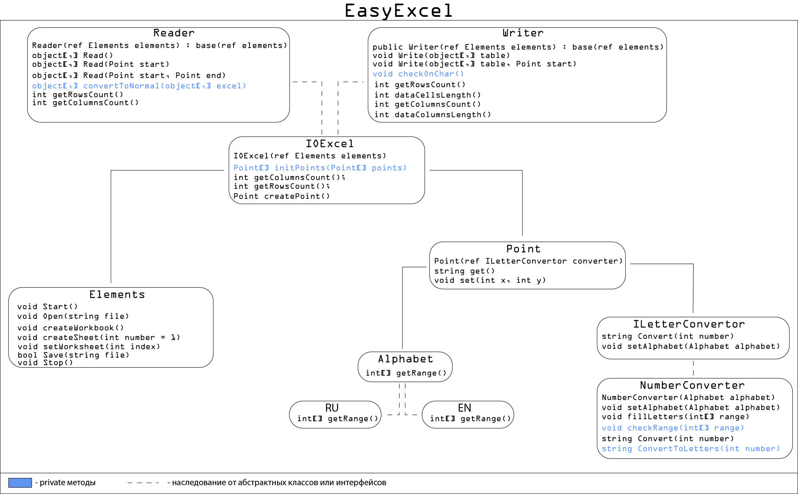

EasyExcel
====

Библиотека создана для упрощения работы с excel.

Зависимости:
----
* Excel 2019 (older versions are not tested)

Считывание данных
----

Q: Документ не редактируется после взаимодействия с данной библиотекой.<br>
A: Значит в результате программы не был вызван метод ```elements.Stop();```, вследствии чего копия Excel всё ещё удерживает документ. Чтобы это исправить надо зайти в ```Диспетчер задач``` и остановить ```фоновые``` процессы связянные с Excel. Такие как ```Microsoft Excel```.

#### Чтение всей страницы

	using EasyExcel;

	Elements elements = new Elements();
	Reader reader = new Reader(ref elements);
	
	// Запускает Excel в скрытом режиме
	elements.Start();
	// Открываем документ (можно писать без расширения ("...\data"))
	elements.Open(@"C:\Users\User\Documents\data.xlsx");
	// Перемещаемся на первую страницу
    elements.setWorksheet(1);
	// Считываем данные
    object[,] result = reader.Read();
	// Останавливаем Excel
	elements.Stop();

#### Чтение части данных

	using EasyExcel;
	
	Elements elements = new Elements();
	Reader reader = new Reader(ref elements);
	
	// Запускает Excel в скрытом режиме
	elements.Start();
	// Открываем документ (можно писать без расширения ("...\data"))
	elements.Open(@"C:\Users\User\Documents\data.xlsx");
	// Перемещаемся на первую страницу
    elements.setWorksheet(1);
	// Создаем точку, с которой начнется считывание данных
	Point point = reader.createPoint();
	// Устанавливаем координаты x, y
    point.set(2,2);
	// Считываем данные
    object[,] result = reader.Read(point);
	// Останавливаем Excel
	elements.Stop();

#### Чтение определенного диапазона данных

	using EasyExcel;
	
	Elements elements = new Elements();
	Reader reader = new Reader(ref elements);
	
	// Запускает Excel в скрытом режиме
	elements.Start();
	// Открываем документ (можно писать без расширения ("...\data"))
	elements.Open(@"C:\Users\User\Documents\data.xlsx");
	// Перемещаемся на первую страницу
    elements.setWorksheet(1);
	// Создаем точки, в диапазоне которых начнется считывание данных
	Point point1 = reader.createPoint();
	Point point2 = reader.createPoint();
	// Устанавливаем координаты x, y
    point1.set(2,2);
    point2.set(2,2);

	// Считываем данные
    object[,] result = reader.Read(point1, point2);
	// Останавливаем Excel
	elements.Stop();

Запись данных
----

#### Создание документа

	using EasyExcel;

	Elements elements = new Elements();
        Writer writer= new Writer(ref elements);

	// Запускает Excel в скрытом режиме
	elements.Start();
	// Создаем рабочую книгу
	elements.createWorkbook();
	// Сохраняем документ (можно писать без расширения ("...\data"))
	elements.Save(@"C:\Users\User\Documents\data.xlsx");
	// Останавливаем Excel
	elements.Stop();

#### Записывание данных, начиная с первой клетки

	using EasyExcel;

	Elements elements = new Elements();
        Writer writer= new Writer(ref elements);

	// Данные для записи
	 object[,] data = new object[,] { { "Name", "Second Name", "Account id" },
                				{ "MX", "Name2", 999 }};

	// Запускает Excel в скрытом режиме
	elements.Start();
	// Устанавливаем рабочий лист
	elements.setWorksheet(1);
	// Записываем данные
	writer.Write(data);
	// Сохраняем документ (можно писать без расширения ("...\data"))
	elements.Save(@"C:\Users\User\Documents\data.xlsx");
	// Останавливаем Excel
	elements.Stop();


#### Записывание данных, начиная с указанной клетки

	using EasyExcel;

	Elements elements = new Elements();
    Writer writer= new Writer(ref elements);

	// Данные для записи
	object[,] data = new object[,] { { "Name", "Second Name", "Account id" },
                				{ "MX", "Name2", 999 }};

	// Запускает Excel в скрытом режиме
	elements.Start();
	// Устанавливаем рабочий лист
	elements.setWorksheet(1);
	
	// Создаем точку, с которой начнется запись данных
	Point point = writer.createPoint();
	// Устанавливаем координаты x, y
	point1.set(10,15);

	// Записываем данные
	writer.Write(data, point1);
	// Сохраняем документ (можно писать без расширения ("...\data"))
	elements.Save(@"C:\Users\User\Documents\data.xlsx");
	// Останавливаем Excel
	elements.Stop();

Редактирование данных
----
	
	using EasyExcel;

	Elements elements = new Elements();
    Writer writer= new Writer(ref elements);

	// Данные для записи
	object[,] data = new object[,] { { "Name", "Second Name", "Account id" },
                				{ "MX", "Name2", 999 }};

	// Запускает Excel в скрытом режиме
	elements.Start();
	// Открываем документ (можно писать без расширения ("...\data"))
	elements.Open(@"C:\Users\User\Documents\data.xlsx");
	// Устанавливаем рабочий лист
	elements.setWorksheet(1);
	
	// Создаем точку, с которой начнется запись данных
	Point point = writer.createPoint();
	// Устанавливаем координаты x, y
    point1.set(10,15);

	// Записываем данные
	writer.Write(data, point1);
	// Сохраняем документ (можно писать без расширения ("...\data"))
	elements.Save(@"C:\Users\User\Documents\data.xlsx");
	// Останавливаем Excel
	elements.Stop();

Документация
----



#### Alphabet
Задача: Возвращение диапазона цифр, при преобразовании которых получается алфавит.

getRange() - возвращает диапазон где находятся буквы (new int[2] { 65, 90 };) => (char) 65 = 'A'

#### NumberConverter
Задача: Конвертация числа в буквы (по системе исчисления Excel). Например 26 => AA.

```char[] letters``` - в данной переменной храниться алфавит

```setAlphabet(Alphabet alphabet)``` - метод заполняет алфавит в letters

```fillLetters(int[] range)``` - метод заполняет алфавит в letters (непосредственно проходит по диапазону и заполняет дуквами массив)

```checkRange(int[] range)``` - проверяет переданный массив на корректность (2 числа, второе больше первого)

```string Convert(int number)``` - проверет значения на положительность и передает управление другому методу(ConvertToLetters(number))

```ConvertToLetters(number)``` - метод содержит алгоритм преобразования числа в координаты Excel (в системе исчисления Excel нет нуля(A,B...Z,AA))

#### Point
Задача: Возможность создания точки, указав X, Y и легкого преобразования их в систему исчисления Excel.

```int x { get; set; }``` - задаем x

```int y { get; set; }``` - задаем y

```string get()``` - возвращает координату ячейки Excel ("R9").

```set(int x, int y)``` - быстрое задание x и y.


#### Elements
Задача: Класс для взаимодействия с Excel.

```Start()``` - запускает Excel и скрывает его то глаз пользователя.

```Open(string file``` - открывает файл

```createWorkbook()``` - создает книгу

```createSheet(int number = 1)``` - создает листы в книге.

```setWorksheet(int index)``` - устанавливает рабочий лист

```Save(string file)``` - сохраняет файл

```Stop()``` - выходит из Excel и очищает память.


#### Reader
Задача: Класс для считывания данных с листа Excel.

```Read(Point start, Point end)``` - читает диапазон ячеек("A1","F9") и записывает их в object[,] (остальные функции Read это вариации данной функции)

```convertToNormal(object[,] excel)``` - функция для исправления массива. При чтении данных модуль Excel возвращает массив начинающийся с единицы ([1...x,1...y]) данный массив не соответствует ожиданиям, из-за чего могут возникнуть баги.

```getRowsCount()``` - возвращает количество строк с данными.

```getColumnsCount()``` - возвращает количество столбцов с данными.

```createPoint()``` - создает проинициализированный обьект класса Point.


#### Writer
Задача: Класс для записи данных в Excel.

```Write(object[,] table, Point start)``` - функция записывает данные в активный лист Excel начиная с позици ```start``` ("F4")(остальные функции Write это вариации данной функции)

```checkOnChar()``` - фунциия для проверки массива на корректность. Т.к. пользователь может захотеть хранить значения ```char``` в Excel, но Excel не умеет хранить даенный тип данных.

```getRowsCount()``` - возвращает количество строк переданного массива.

```getColumnsCount()``` - возвращает количество столбцов переданного массива.

```dataCellsLength()``` - возвращает отступ по Y.

```dataColumnsLength()``` - возвращает отступ по X.

```createPoint()``` - создает проинициализированный обьект класса Point.


* PS: I hope you are not using excel instead of a database.